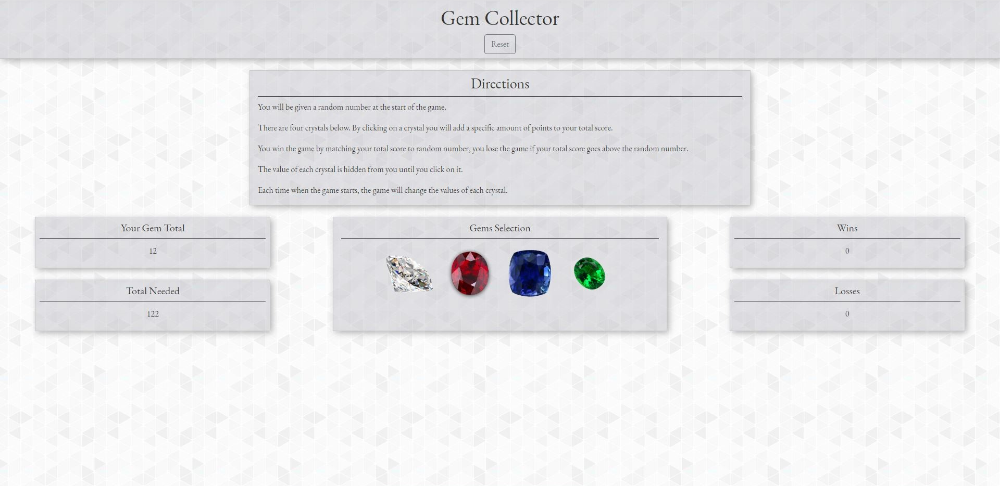

# unit-4-game

##Welcome to Gem Collector!
 
[https://kayleighs.github.io/unit-4-game/]

 
You will be given a random number at the start of the game. There are four crystals below. By clicking on a crystal you will add a specific amount of points to your total score. You win the game by matching your total score to random number, you lose the game if your total score goes above the random number. The value of each crystal is hidden from you until you click on it. Each time when the game starts, the game will change the values of each crystal.